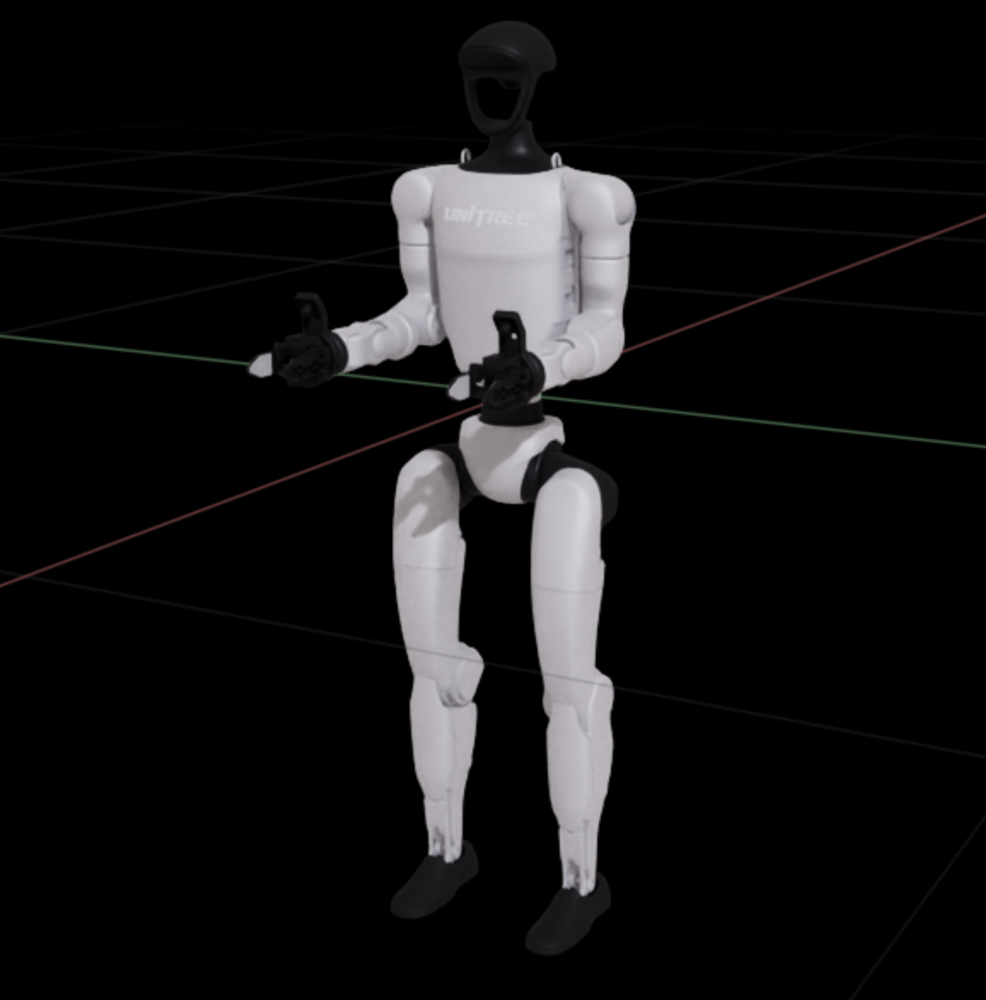
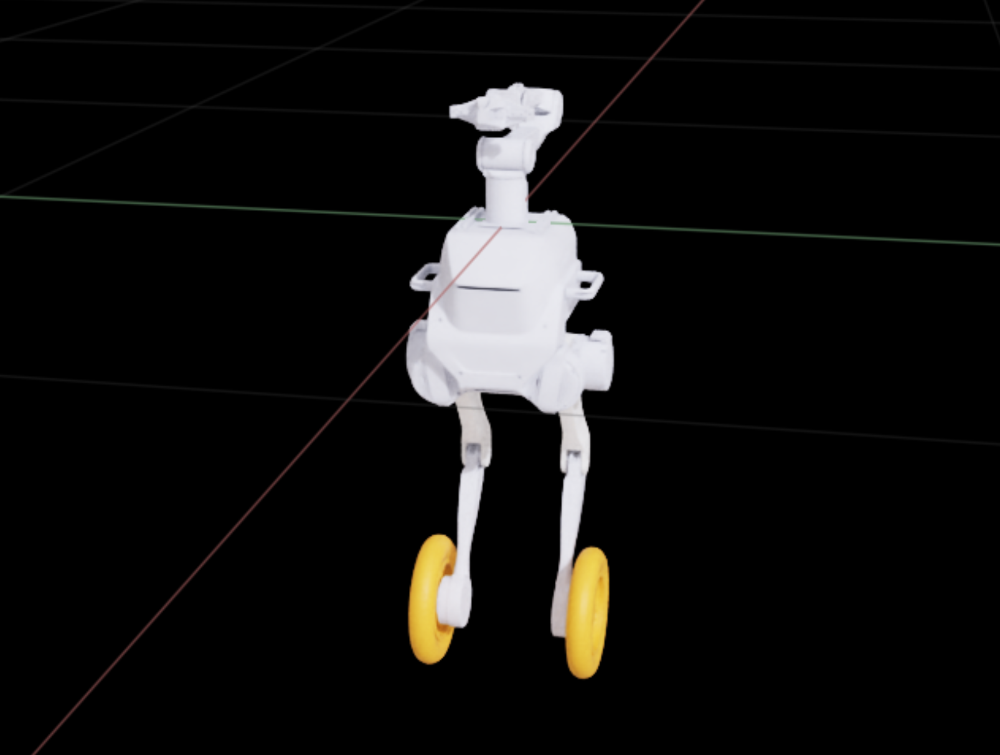
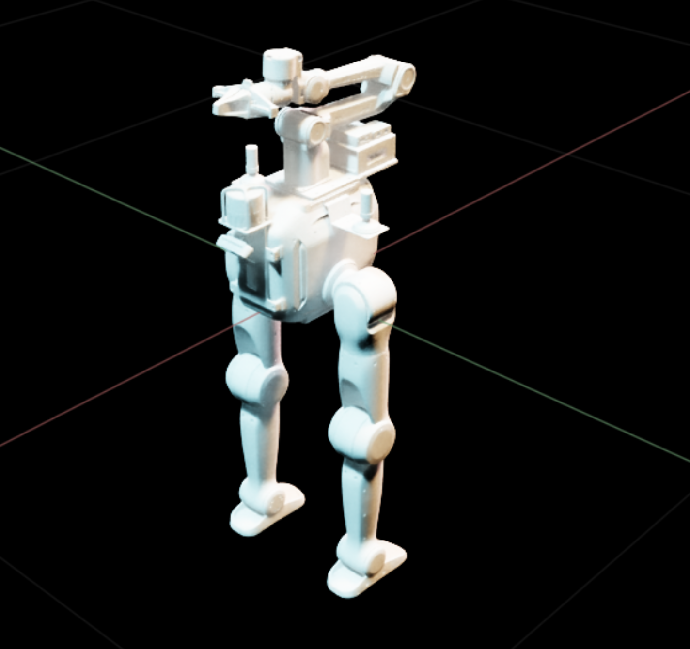
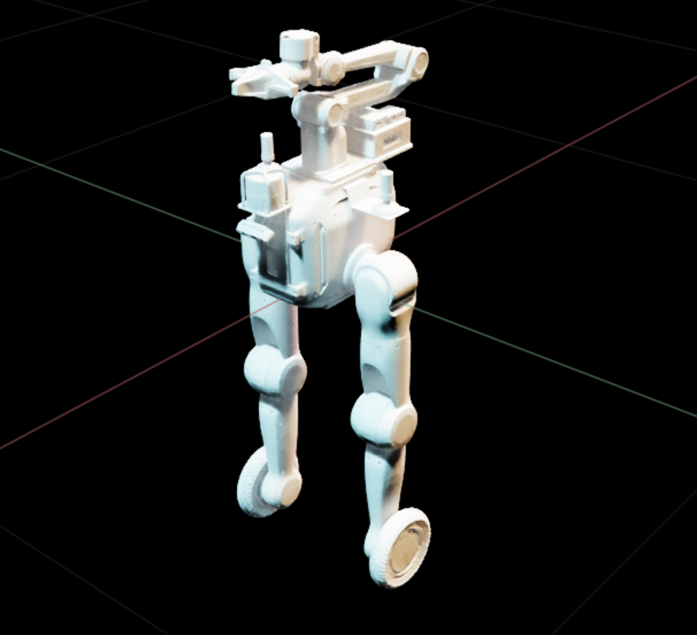
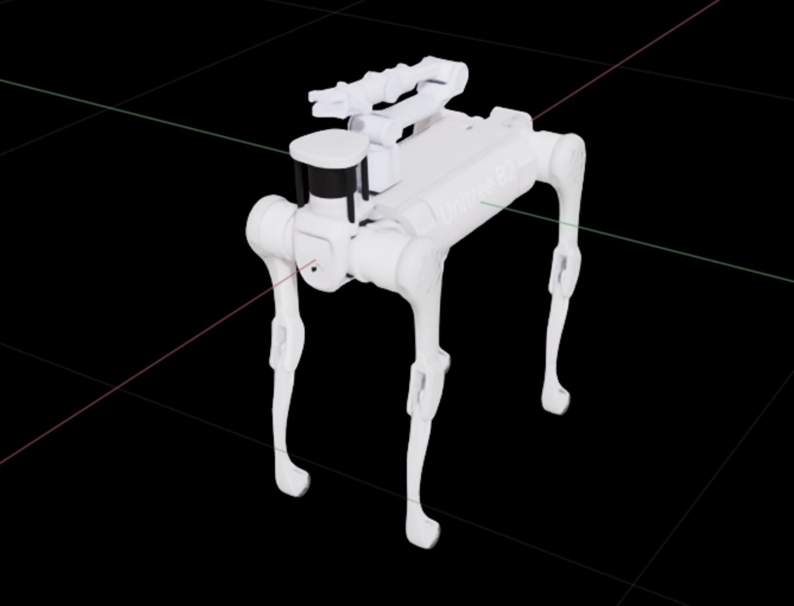
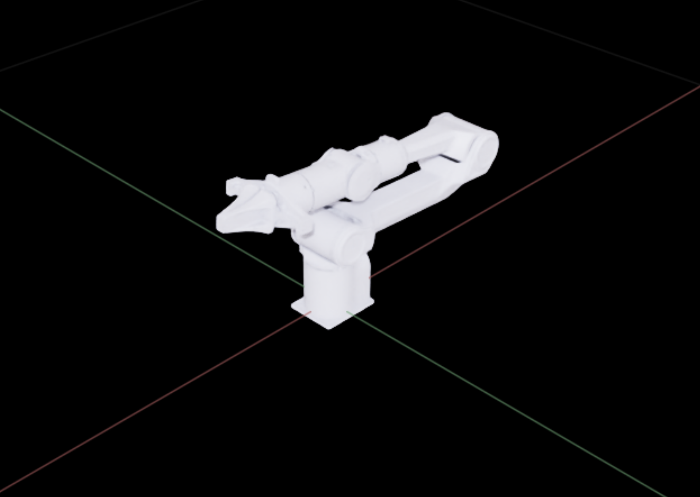
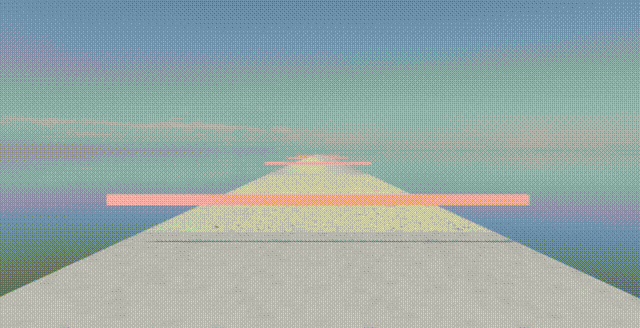
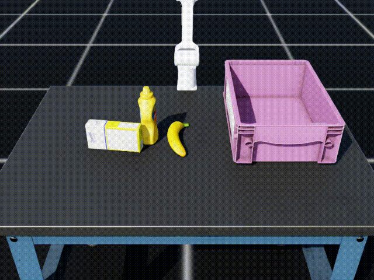

## 1. Introduction

The ATEC 2026 Simulation Challenge provides a standardized suite of robot simulation environments built on IsaacLab, designed to evaluate both locomotion and loco-manipulation capabilities. Participants may select one or multiple legged robot platforms to complete a set of representative tasks, including *Off-road Navigation*, *Tabletop Manipulation*, *Garbage Collection*, and *Obstacle Traversal*.  

This repository includes simulation assets, task definitions, and reference scripts to support development, evaluation, and submission.

---

### 1.2 Robots and Sensors

- **Robot platforms**
  - Humanoid: Unitree G1 (with two-finger gripper)
  - Dual-wheel legged + manipulator: Tron1 + AgileX Piper
  - Tron2A legged / wheel + manipulator
  - Quadruped + manipulator: Unitree B2 + AgileX Piper
  - Wheel-legged quadruped + manipulator: Unitree B2W + AgileX Piper
  - Manipulator-only: AgileX Piper
- **Sensor suite** (standardized across platforms)
  - 1 × LiDAR  
  - 1 × eye-to-hand RGB-D camera  
  - 1 × eye-in-hand RGB-D camera *(humanoids use a stereo pair)*  
  
  ## Robot Platforms


  |                        Humanoid                        |              Dual-wheel legged + manipulator              |                  Tron2A legged + manipulator                  |                  Tron2A wheel + manipulator                  |                Quadruped + manipulator                |          Wheel-legged quadruped + manipulator          |                        Manipulator                        |
  | :----------------------------------------------------: | :-------------------------------------------------------: | :-----------------------------------------------------------: | :----------------------------------------------------------: | :----------------------------------------------------: | :-----------------------------------------------------: | :-------------------------------------------------------: |
  | <p align="center"> | <p align="center"> | <p align="center"> | <p align="center"> | <p align="center"> | <p align="center"> | <p align="center"> |

> **Note:** Users may modify or optimize assets (e.g., collision geometry simplification) for training purposes. The provided assets serve as reference models for evaluation.

---

### 1.3 Challenge Arenas

| Arena | Video | Arena | Video |
| --- | --- | --- | --- |
| Task A · Off-road Navigation | <p align="center"> | Task E · Tabletop Manipulation | <p align="center"> |
| Task B · Garbage Collection | <p align="center"> | Task D · Obstacle Traversal | <p align="center"> |

> **Note:** For each task, participants are free to select any supported robot morphology.

---

### 1.4 Environment Matrix

The `atec_rl_lab.tasks` module registers all **arena–robot combinations** as Gym-compatible environments, enabling unified interfaces for evaluation and submission.


| Arena \ Robot | G1              | Tron1Piper              | Tron2ALegged              | Tron2AWheel              | B2Piper              | B2wPiper              | Piper              |
| ------------- | --------------- | ----------------------- | ------------------------- | ------------------------ | -------------------- | --------------------- | ------------------ |
| Task A        | `ATEC-TaskA-G1` | `ATEC-TaskA-Tron1Piper` | `ATEC-TaskA-Tron2ALegged` | `ATEC-TaskA-Tron2AWheel` | `ATEC-TaskA-B2Piper` | `ATEC-TaskA-B2wPiper` |                    |
| Task B        | `ATEC-TaskB-G1` | `ATEC-TaskB-Tron1Piper` | `ATEC-TaskB-Tron2ALegged` | `ATEC-TaskB-Tron2AWheel` | `ATEC-TaskB-B2Piper` | `ATEC-TaskB-B2wPiper` |                    |
| Task D        | `ATEC-TaskD-G1` | `ATEC-TaskD-Tron1Piper` | `ATEC-TaskD-Tron2ALegged` | `ATEC-TaskD-Tron2AWheel` | `ATEC-TaskD-B2Piper` | `ATEC-TaskD-B2wPiper` |                    |
| Task E        |                 |                         |                           |                          |                      |                       | `ATEC-TaskE-Piper` |

> **Note:** The provided environments are designed for evaluation and submission only and do not support parallelized training. For training, users should implement custom wrappers or leverage external frameworks for efficient learning.

---

## 2. Installation

This repository is developed and tested with **Isaac Lab v2.3.2**. Earlier versions (e.g., v1.4.1) are not validated and may require modification.

Follow the official Isaac Lab installation [guide](https://isaac-sim.github.io/IsaacLab/main/source/setup/installation/pip_installation.html).

### 2.1 Setup

Clone repository
```bash
git clone https://github.com/atecup/ATEC2026_Simulation_Challenge.git
cd ATEC2026_Simulation_Challenge
```

Activate Isaac Lab Environment

```bash
conda activate isaaclab
```

Install ATEC Extension
```bash
cd source/atec_rl_lab
pip install -e .
```

After installation, all `ATEC-*` environments will be available in the active Python environment.

Download Robot Models
```bash
cd ATEC2026_Simulation_Challenge
curl https://static.atecup.com/atec2026/atec_robot_model.zip -o atec_robot_model.zip
unzip atec_robot_model.zip -d atec_robot_model
```

---

## 3. Running the Environments

### 3.1 Environment Check

```bash
cd ATEC2026_Simulation_Challenge
python scripts/list_envs.py
```

Successful execution will list all registered environments, confirming correct module loading.

---

### 3.2 Visualization Utilities

```bash
scripts/view_robots.py – inspect robot models
scripts/view_task_a.py – Task A visualization
scripts/view_task_b.py – Task B visualization
scripts/view_task_d.py – Task D visualization
scripts/view_task_e.py – Task E visualization
```

Example:

```
python scripts/view_task_a.py --enable_cameras
```

---

### 3.3 Submission and Evaluation

Participants can test their solutions using:
```bash
cd ATEC2026_Simulation_Challenge

python scripts/play_atec_task.py --task ATEC-TaskA-G1 --enable_cameras
```

#### Implementation Requirement

Participants must implement demo/solution.py, and this file name can not be changed.
* Class: AlgSolution
* Optional Function: get_action_spec(), where participants may customize action mode, scale, and clip range. Return None to use the default action configuration.
* Function: predicts(obs, current_score), where **obs** is the observation, and **current_score** is the current score
* Return: {"action": action, "giveup": False}, where action is the prediction action represented by List, and **giveup** is the giveup flag. if **giveup** is True, the scoring job will be terminated.


### 3.4 Observations and Actions

#### Tasks A / B / D

Observations are grouped into:

- `Proprioception`: base velocity, joint states, previous actions
- `Exteroception`: LiDAR-based height scan
- `Vision`: RGB-D images from head and end-effector cameras

All observation terms are:

- noise-injected
- order-preserved
- concatenated per group

#### Task E (Manipulation-only)

Observations include:

- `Proprioception`: joint states (position + velocity)

- `Vision`: RGB-D images from end-effector and external camera

  

**Note:** Joint indices follow fixed ordering per robot (critical for policy deployment).

- b2_piper (20 DoF)
- b2w_piper (24 DoF)
- G1 (33 DoF)
- tron1a_piper (16 DoF)
- piper (8 DoF)

#### Action Space

Robot control actions are organized by joint type.

- Leg joints and manipulator joints are controlled by joint position commands.
- Wheel joints of wheeled robots are controlled by joint velocity commands.

The action configuration is as follows:

```
joint_leg = mdp.JointPositionActionCfg(
    asset_name="robot",
    joint_names=[""],
    scale=0.5,
    use_default_offset=True,
    clip=None,
    preserve_order=True,
)

joint_wheel = mdp.JointVelocityActionCfg(
    asset_name="robot",
    joint_names=[""],
    scale=5.0,
    use_default_offset=True,
    clip=None,
    preserve_order=True,
)

joint_arm = mdp.JointPositionActionCfg(
    asset_name="robot",
    joint_names=[""],
    scale=0.5,
    use_default_offset=True,
    clip=None,
    preserve_order=True,
)
```

##### Scaling rules

- Leg position commands are scaled by 0.5 before being applied to the robot.
- Arm position commands are scaled by 0.5 before being applied to the robot.
- Wheel velocity commands are scaled by 5.0 before being applied to the robot.

Different robots enable different action items according to their structure:

- Standard legged robots
  (humanoid robots, quadruped mobile manipulator robots, manipulator) do not enable wheel velocity control.
- Wheeled legged robots
  (Dual-wheel legged mobile manipulator robots, quadruped-wheel legged mobile manipulator robots)
  enable wheel velocity control.

#### Custom Action Configuration

Participants may optionally customize the action configuration in `demo/solution.py` by implementing `AlgSolution.get_action_spec()`.

If `get_action_spec()` returns `None`, the official default action configuration is used.

```python
from typing import Any


class AlgSolution:
    def get_action_spec(self) -> dict[str, dict[str, Any]] | None:
        return None

    def predicts(self, obs, current_score):
        ...
```

The returned action spec is a dictionary whose keys are action groups:

- `leg`: leg joints
- `wheel`: wheel joints
- `arm`: manipulator joints

Each group may define the following fields:

- `mode`: one of `"position"`, `"velocity"`, or `"effort"`
- `scale`: positive float
- `clip`: `None` or `[min, max]`

Example:

```python
from typing import Any


class AlgSolution:
    def get_action_spec(self) -> dict[str, dict[str, Any]] | None:
        return {
            "leg": {
                "mode": "position",
                "scale": 1.0,
                "clip": [-10.0, 10.0],
            },
            "wheel": {
                "mode": "velocity",
                "scale": 2.0,
                "clip": [-11.0, 11.0],
            },
            "arm": {
                "mode": "effort",
                "scale": 3.0,
                "clip": [-12.0, 12.0],
            },
        }

    def predicts(self, obs, current_score):
        ...
```

Notes:

- Missing groups use the official default configuration.
- If a robot does not have a requested action group, that group is ignored.
- The joint names and joint order are inherited from the selected task and robot.

## Contributors
- **[CUHK Legged Robot Lab](https://cuhkleggedrobotlab.github.io/)**
- **[曾兆阳](https://zengzhaoyang.com/)**
- **[ATEC (Advanced Technology Exploration Community)](https://www.atecup.com)**

## License
This project is licensed under the MIT License - see the [LICENSE](LICENSE) file for details.
